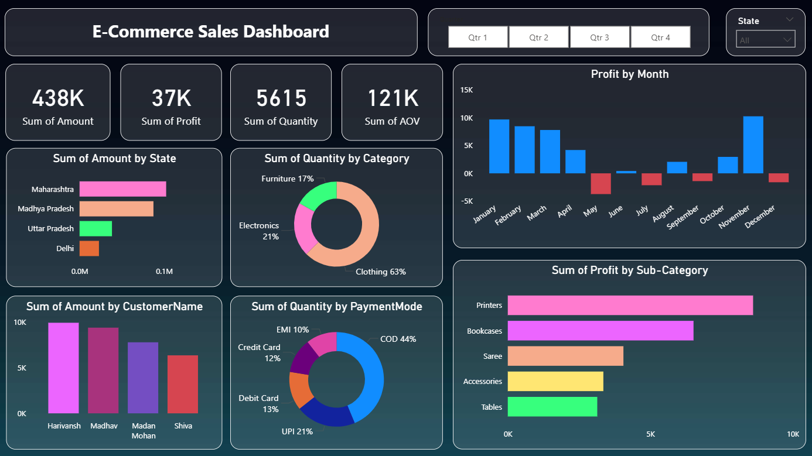

# 🛒 E-Commerce Sales Dashboard (Power BI)

🔗 **Live Demo:** [View Dashboard](https://app.powerbi.com/)  
📁 **Dataset:** [E-Commerce Sales Dataset](https://www.kaggle.com/)  
📸 **Instagram:** [Follow Me](https://www.instagram.com/mohhitaggarwal)  
💼 **LinkedIn:** [Get In Touch](https://www.linkedin.com/in/mohitaggarwalofficial)

---

## 📌 Project Overview

The **E-Commerce Sales Dashboard** is an interactive Power BI dashboard built to analyze **sales performance, profit trends, customer behavior, product categories, and payment modes** across multiple states and time periods.

This dashboard helps:
- Businesses track **revenue and profitability**
- Identify **top-performing states, customers, and products**
- Understand **monthly profit trends**
- Analyze **customer purchasing patterns**

---

## 🧭 Dashboard Pages

### 1️⃣ E-Commerce Sales Overview Dashboard

**Key Metrics:**
- **Total Sales Amount:** 438K  
- **Total Profit:** 37K  
- **Total Quantity Sold:** 5,615  
- **Average Order Value (AOV):** 121K  

**Insights Provided:**
- Clear visibility of **monthly profit fluctuations**
- Identification of **loss-making months**
- Strong contribution from **Clothing category**
- **COD** is the most used payment method

**Visuals Included:**
- KPI Cards (Sales, Profit, Quantity, AOV)
- Profit by Month (Column Chart)
- Sales by State (Horizontal Bar Chart)
- Quantity by Category (Donut Chart)
- Quantity by Payment Mode (Donut Chart)
- Profit by Sub-Category (Bar Chart)
- Sales by Customer Name (Column Chart)
- Quarter & State slicers for interactivity

---

## 📊 Key Visual Insights

### 🔹 Category Contribution
- Clothing: **63%**
- Electronics: **21%**
- Furniture: **17%**

### 🔹 Payment Mode Analysis
- Cash on Delivery (COD): **44%**
- UPI: **21%**
- Debit Card: **13%**
- Credit Card: **12%**
- EMI: **10%**

### 🔹 State-wise Sales
- Maharashtra leads in total sales
- Followed by Madhya Pradesh and Uttar Pradesh
- Delhi contributes comparatively lower sales

### 🔹 Monthly Profit Trend
- High profits in **January, February, and December**
- Losses observed in **May, July, and December**
- Seasonal trends clearly visible

---

## 🛠️ Tools & Technologies Used

- **Power BI Desktop**
- **DAX (Data Analysis Expressions)**
- **Power Query**
- **Data Modeling**
- **Custom Dark Theme UI**
- **Interactive Slicers & Filters**

---

## 📂 Dataset Information

- Source: Sample E-Commerce Sales Dataset
- Data includes:
  - Order Date
  - State
  - Customer Name
  - Category & Sub-Category
  - Sales Amount
  - Profit
  - Quantity
  - Payment Mode

> ⚠️ Dataset is used for learning, analytics, and portfolio purposes only.

---

## 🎯 Key Business Insights

- **Clothing category** dominates sales volume
- **Printers** generate the highest profit among sub-categories
- **COD** remains the most preferred payment method
- Certain months consistently show **negative profit**, indicating operational or discount issues
- Top customers significantly impact total revenue

---

## 🚀 How to Use the Dashboard

1. Use **Quarter slicers (Qtr 1–Qtr 4)** to analyze seasonal trends
2. Filter data by **State**
3. Click on any chart to **cross-filter** other visuals
4. Hover over visuals for **detailed tooltips**

---

## 📸 Dashboard Screenshot

### E-Commerce Sales Dashboard

---

## 📥 How to Access

### Option 1: Power BI Service
👉 [Open Live Dashboard](https://app.powerbi.com/)

### Option 2: Local Setup
1. Download the `.pbix` file from this repository
2. Open it using **Power BI Desktop**
3. Refresh the dataset if required

---

## 📌 Future Enhancements

- Add **year-wise comparison**
- Customer segmentation (New vs Returning)
- Profit forecasting using time-series analysis
- Drill-through pages for customer & product insights
- Integration with real-time sales data

---

## 📄 License

This project is licensed under the **MIT License** — free to use, modify, and distribute.

---

## 🙌 Acknowledgements

- Kaggle & public e-commerce datasets
- Microsoft Power BI documentation
- Data analytics & visualization community

---

### ⭐ If you like this project, don’t forget to give it a star!
